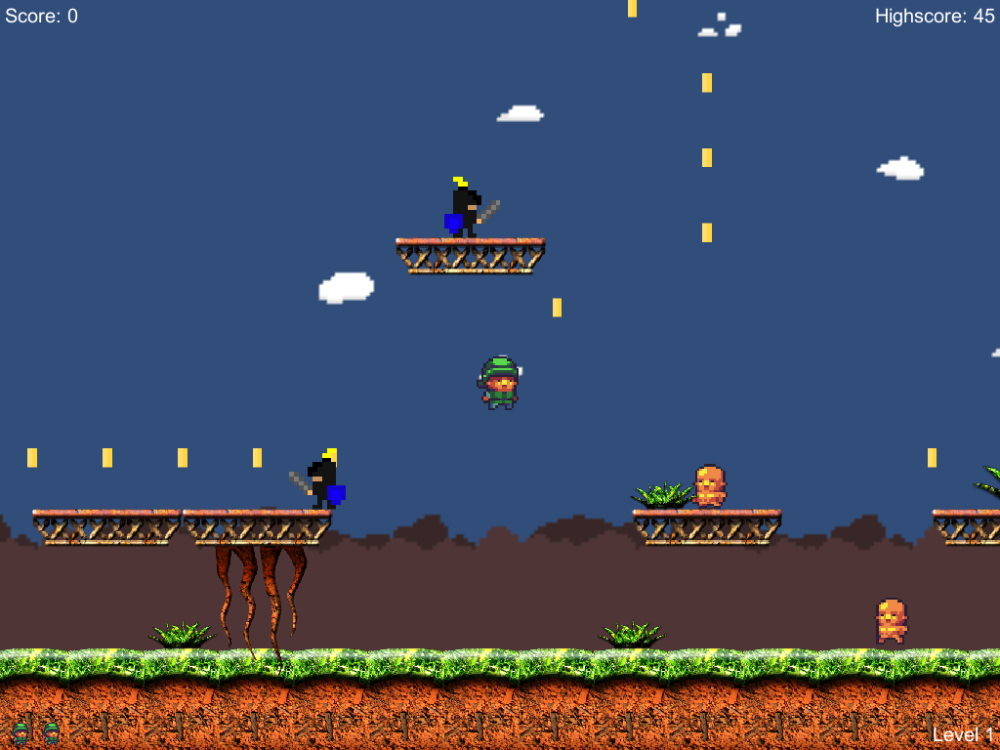

# Super Sparty Bros.

Final project for the Game Development for Modern Platforms course from Michigan State University.  Created with Unity3D.

### Credits
<ol>
    <li>Background song: 
<a href="http://incompetech.com/music/royalty-free/index.html?isrc=USUAN1300025">The Complex</a> Kevin MacLeod (incompetech.com) 
    Licensed under Creative Commons: By Attribution 3.0 License 
    http://creativecommons.org/licenses/by/3.0/
</li>
    <li>Skin updates: <a href="http://opengameart.org/content/mystery-forest-tile-set">Mystery Forest Tile Set</a></li> 
    <li>Updated characters: <a href="http://opengameart.org/content/a-platformer-in-the-forest">A platformer in the forest</a></li> 
    <li>Coin sounds: <a href="http://opengameart.org/content/10-8bit-coin-sounds">10 8bit coin sounds</a></li>
</ol>